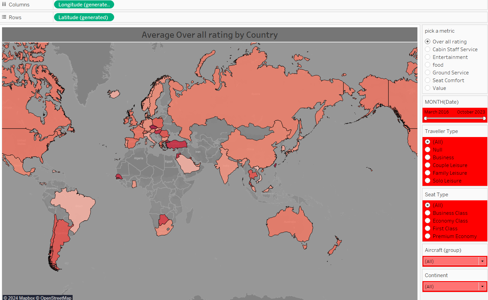
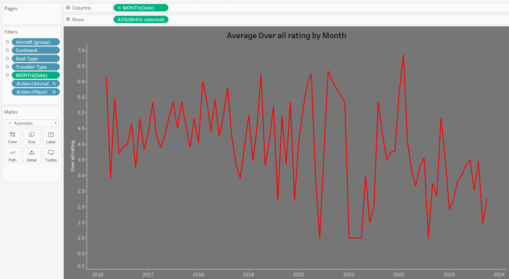
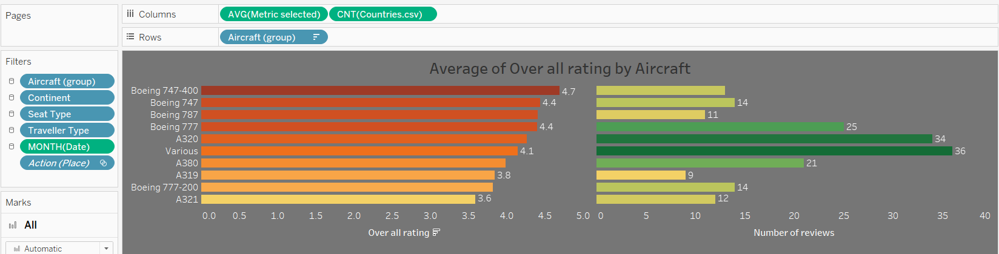
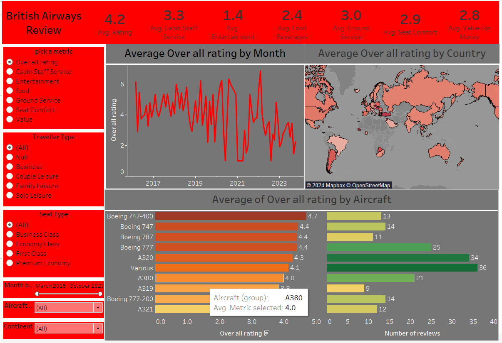

# british_airways
1. To prepare the dashboard british air ways review file and the countries code files were taken.
2. The common column in both the files taken was the place column in the ba_reviews file which is compared to the country column in the country_code table.
3. This from a many to many relationship in between the two tables
4. In tableau the Longitude and latitude data was auto generated by taking the country names.
5. Using the longitude and latitude data the ma was drawn and relatable filters were created

1. The average rating in each every category were calculated by using the measure values.
2. Then average rating of the each month in all catories was represented in the form of line graph.

1. The number of reviews and overall rating of the top 10 aircrafts was represented in the form of the bar graphs.

### Finally all these visuals were combined and cross filters were activated to form the dashboard which provide the insights were to increase the focus for the customer satification.

